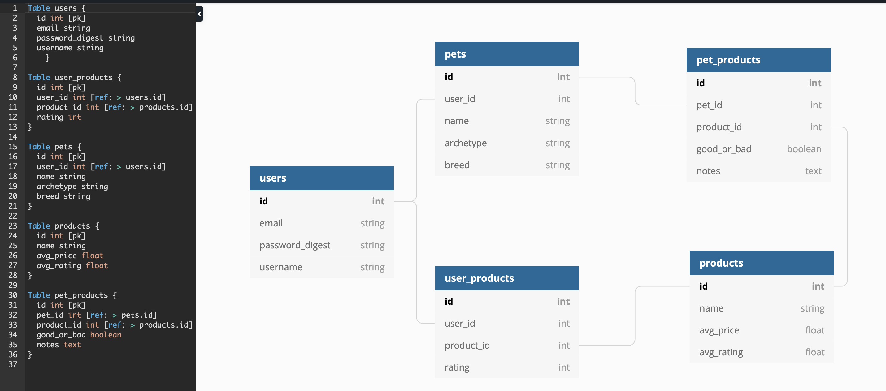

# PetfulLife API

## Introduction

This RESTful JSON API built in Ruby on Rails (RoR) 5.2 is the back end for PetfulLife, a virtual assistant for your pet's life. The [front end repository](https://github.com/petful-life/petfulLife) is built in React Native, and the app is deployed to the Google Play Store [here](https://futuredeployedlink82345923874234.com). This app is the capstone project at [Turing School of Software and Design](https://turing.io/) for the four [core contributors](#core-contributors) and an example of what a full stack team of Turing students can build.

## Initial Setup

Please make sure you have Rails 5.2 installed in your ruby enviornment. If you do not have Ruby or Rails installed, some setup directions can be found [here](https://guides.rubyonrails.org/getting_started.html).

In order to run this API on your local maching, please fork and clone this repository, then from a terminal within the project directory run the following commands:

`bundle install`
`rails s`

The app is configured to run on `localhost:3000`.

A convenient way to interact with an API-only rails app is through [postman](https://www.getpostman.com/).

## How to use

A sample request could be GET `localhost:3000/api/v1/products`.  

#### Products

**`GET /api/v1/products`**:  

Upon success:  
Status -- 200
Return all products, serialized as:  
```
[
    {
        "id": 1,
        "name": "Purina Puppy Chow",
        "avg_rating": 4.74,
        "avg_price": 25.91
        "createdAt": "2019-07-02T19:15:59.841Z",
        "updatedAt": "2019-07-02T19:15:59.841Z"
    },
    {
        "id": 2,
        "name": "Purina Kitten Pate",
        ...
    },
    ...
]
```

## Tests

The test suite for this project is rspec. In order to run the suite, after following the [initial setup](#initial-setup) instructions above, run the following from a terminal in the root project directory:

`bundle exec rspec`

## Core Contributors

#### Back End Team:
[Vincent Provenzano](https://github.com/Vjp888)
[Jeremy Bennett](https://github.com/jaxjafinpapau)

#### Front End Team:
[Adam Niedzwiecki](https://github.com/AdamN8142)
[Lauren Boyer](https://github.com/lboyer4)

## How to Contribute

Please follow the [initial setup](#initial-setup) instructions, then when you have completed your contribution, create a pull request to the PetfulLife API master branch.

## Database Schema



## Tech Stack

- Ruby on Rails 5.2